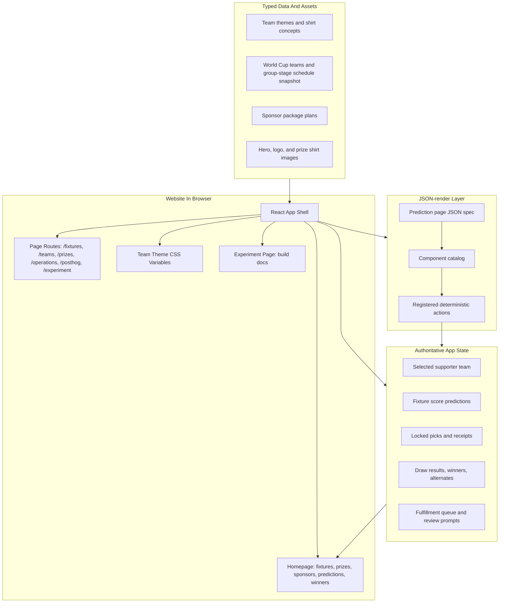
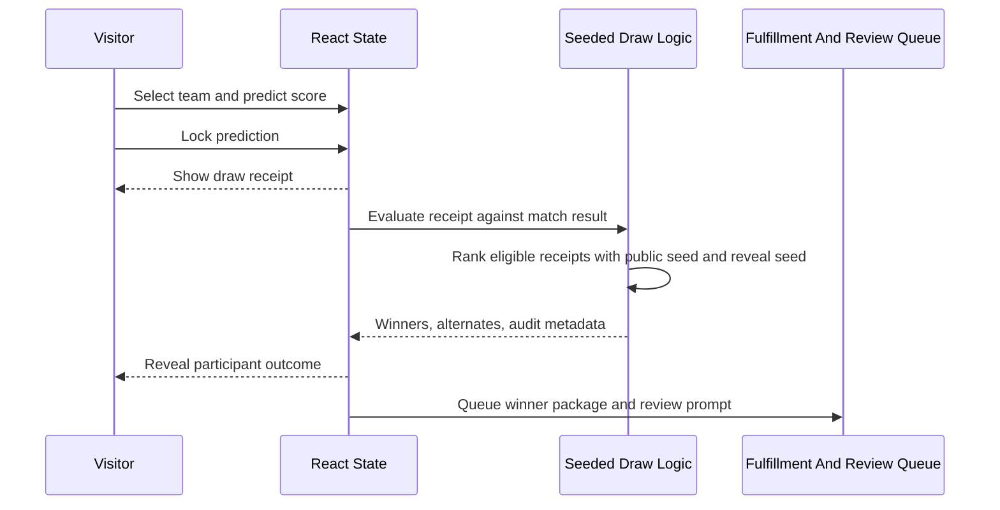

# Website Flow And Tools

This document explains how the World Cup Predictor website works and which tools are used to build it. It is intended for the build article and Experiment view, not for homepage copy.

## Visitor Experience

The homepage is centered on matches, predictions, prizes, sponsors, and winners. Technical build details stay in the footer-linked Experiment view.

```mermaid
flowchart LR
  A["Visitor opens Win World Cup 2026"] --> B["Choose supporter team"]
  B --> C["Theme updates to selected team"]
  C --> D["Review fixtures, sponsor packages, and prize drops"]
  D --> E["Predict match score"]
  E --> F["Lock prediction"]
  F --> G["Draw entry receipt is created"]
  G --> H["Match result closes"]
  H --> I{"Prediction correct?"}
  I -- "No" --> J["Participant sees not qualified state"]
  I -- "Yes" --> K["Ticket enters match draw"]
  K --> L["Seeded draw ranks eligible tickets"]
  L --> M["5-10 winners revealed"]
  M --> N["Winner receives team shirt and sponsor package"]
  N --> O["Winner is prompted to review sponsor products"]
```

## Page Routes

The public site uses page-style paths instead of hash fragments. Internal links update browser history without reloading the app, and a Vercel rewrite supports direct refreshes on deployed routes.

| Path | Purpose |
| --- | --- |
| `/` | Homepage with supporter team, prize, sponsor, and prediction workflow overview. |
| `/fixtures` | Focused prediction system page. |
| `/teams` | Teams and group-stage schedule page. |
| `/draws` | Match-level draw page. |
| `/prizes` | All localized shirt prize previews. |
| `/prizes/:team` | Standalone team prize page, such as `/prizes/japan`. |
| `/shirts` | Supporter T-shirt studio page. |
| `/sponsors` | Sponsor package page. |
| `/rewards` | Fulfillment and review page. |
| `/operations` | POD, 3PL, and provider plan page. |
| `/posthog` | Product analytics dashboard contract for PostHog funnels and event taxonomy. |
| `/experiment` | Build documentation page. |

Legacy URLs such as `/#operations`, `/#posthog`, `/#experiment`, and `/#prizes/japan` are normalized to `/operations`, `/posthog`, `/experiment`, and `/prizes/japan`.

## App Architecture

React owns the domain state and business behavior. JSON-render controls a constrained, spec-driven product surface, but it does not own prize, draw, fulfillment, or eligibility rules.

## Draw Mechanism

The prototype draw is deterministic so the same inputs can be audited. Production still needs persistence, identity, official rules, eligibility checks, and fulfillment operations.

## Tools Used

| Area | Tools | How They Are Used |
| --- | --- | --- |
| App framework | Vite, React, TypeScript | Build the page-routed interactive website. |
| Spec-driven UI | `@json-render/core`, `@json-render/react` | Render controlled product sections from a JSON spec and registered component catalog. |
| Validation | `zod` | Define typed component props and action schemas for the JSON-render catalog. |
| Icons | `lucide-react` | Provide consistent interface icons for buttons, navigation, prizes, draws, sponsor packages, and operations. |
| Styling | CSS variables, responsive CSS | Apply supporter-team themes and responsive layouts without hard-coding each team page. |
| Data | `src/data/worldCup.ts`, `src/data/worldCupSchedule.ts` | Store team themes, shirt concepts, sponsor packages, demo draw data, teams, fixtures, venues, and schedule metadata. |
| Assets | Generated hero image, attached SVG logo, generated shirt mockups | Provide the stadium visual, active brand mark, and localized prize previews. |
| Build documentation | `AGENTS.md`, `BUILD_BLOG.md`, `PRODUCT.md`, `DESIGN.md`, `WEBSITE_FLOW.md` | Track product decisions, design rules, architecture, tools, and build history. |
| Build agent | Codex Desktop App | Collaboratively edits code, verifies the app, documents the process, commits, pushes, and opens PRs. |
| Infrastructure planning | `https://projects.dev/` / Stripe Projects | Tracks planned infrastructure provisioning for database, auth, analytics, hosting, observability, and spend controls. |
| Analytics | Google Analytics GA4, PostHog, `gtag.js` | Loads the GA4 tag with measurement ID `G-RFPJRPKYQR`; `/posthog` defines the product analytics dashboard contract. PostHog SDK capture is still pending tracking and privacy approval. |
| Source control | Git, GitHub, GitHub CLI | Manage commits, branches, pushes, and pull requests. |
| Verification | `npm run lint`, `npm run build`, browser checks | Confirm code quality, production build success, and key rendered states. |
| Deployment routing | `vercel.json` rewrite | Let direct page refreshes such as `/operations` and `/experiment` resolve to the Vite app entry. |

## Planned Production Integrations

These are not live production integrations yet:

- Database persistence for users, predictions, draw receipts, winners, shipments, and reviews.
- Authentication and participant profiles.
- Official contest rules, eligibility, fraud controls, and no-purchase disclosures.
- POD provider for localized winner shirts, with Gelato as the first researched option and Printful as a backup/control option.
- 3PL or kitting partner for sponsor product packages.
- Admin tooling for sponsor campaigns, product SKUs, winner review videos, and fulfillment batches.
- PostHog SDK capture, real dashboard tiles, session replay policy, and privacy disclosures.
- Funnel analytics events for prediction starts, locked receipts, draw entries, winner reveals, claims, deliveries, and review prompts.
